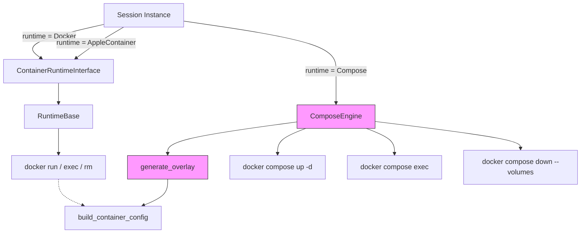

# Docker Compose Overlay -- Detailed Design

## Overview

Add a Docker Compose runtime mode to AoE. When enabled, AoE generates a runtime overlay YAML that defines the agent service (image, volumes, env, resource limits) and composes it with the user's own compose file(s). AoE manages the full stack lifecycle via `docker compose up/down` and interacts with the agent via `docker compose exec`. The Docker engine and Compose engine are mutually exclusive.

## Detailed Requirements

1. **New runtime variant**: `Compose` added to `ContainerRuntimeName` enum.
2. **Nested config**: `[sandbox.compose]` section with `compose_files` (list of paths relative to project root) and `agent_service` (string, default `aoe-agent`).
3. **AoE fully owns the agent service**: The overlay defines the complete agent service from scratch (image, command, volumes, env, working_dir, resource limits). The user's compose file contains only their own services (db, redis, etc.).
4. **File ordering**: `docker compose -f user1.yaml [-f user2.yaml ...] -f overlay.yaml -p aoe-{id} up -d`. Overlay is always last.
5. **All shared settings carry over**: `default_image`, `extra_volumes`, `environment`, `environment_values`, `volume_ignores`, `mount_ssh`, `cpu_limit`, `memory_limit` all feed into the overlay via `build_container_config()`.
6. **Overlay persistence**: Written to `{app_dir}/compose-overlays/{session_id_prefix}.override.yaml`. Survives process restarts.
7. **Exec via compose**: `docker compose -f ... -p ... exec [-T] [-w ...] [-e ...] <service> <cmd>`. TTY is on by default (no `-it` needed), `-T` for non-interactive.
8. **Cleanup**: `docker compose -f ... -p ... down --volumes`, then delete overlay file.
9. **Compose v2 only**: Check `docker compose version` on startup when runtime = Compose. Error if missing.
10. **Docker-only**: Compose variant is not available with Apple Container runtime.
11. **TUI**: Compose-specific fields shown only when runtime = Compose.
12. **Error handling**: Let `docker compose up` handle image pulling and fail on its own. Surface stderr in TUI.
13. **No extra persistence**: Project name, file paths, overlay path all derived from session ID + config.

## Architecture Overview



The `ComposeEngine` is a separate struct, not implementing `ContainerRuntimeInterface`. Dispatch happens at call sites in `instance.rs` by matching on `container_runtime`.

## Components and Interfaces

### 1. Config Changes

**File**: `src/session/config.rs`

Add `Compose` variant to `ContainerRuntimeName`:

```rust
pub enum ContainerRuntimeName {
    AppleContainer,
    #[default]
    Docker,
    Compose,
}
```

Add `ComposeConfig` struct and nest it in `SandboxConfig`:

```rust
#[derive(Debug, Clone, Serialize, Deserialize)]
pub struct ComposeConfig {
    /// Compose file paths, relative to project root
    pub compose_files: Vec<String>,
    /// Service name for the agent container in the overlay
    #[serde(default = "default_agent_service")]
    pub agent_service: String,
}

fn default_agent_service() -> String {
    "aoe-agent".to_string()
}

pub struct SandboxConfig {
    // ... existing fields ...
    pub compose: Option<ComposeConfig>,
}
```

TOML example:

```toml
[sandbox]
container_runtime = "Compose"

[sandbox.compose]
compose_files = ["docker-compose.yml", "docker-compose.db.yml"]
agent_service = "aoe-agent"
```

Runtime validation: when `container_runtime = Compose`, `compose` must be `Some` with at least one file in `compose_files`. Error at session start otherwise.

### 2. ComposeEngine

**New file**: `src/containers/compose.rs`

```rust
pub struct ComposeEngine {
    project_name: String,
    compose_files: Vec<PathBuf>,  // resolved absolute paths
    overlay_path: PathBuf,
    agent_service: String,
}
```

**Methods**:

| Method | Description | Command |
|---|---|---|
| `new(session_id, project_path, config, app_dir)` | Build engine from session + config | -- |
| `generate_overlay(config: &ContainerConfig, image: &str)` | Write overlay YAML to disk | -- |
| `up()` | Start the stack | `docker compose -f ... -p ... up -d` |
| `down(remove_volumes: bool)` | Stop and remove stack | `docker compose -f ... -p ... down [--volumes]` |
| `is_running()` | Check if agent service is running | `docker compose -f ... -p ... ps --format json --status running <service>` |
| `exists()` | Check if stack/service exists (any state) | `docker compose -f ... -p ... ps --format json <service>` |
| `exec(cmd: &[&str])` | Non-interactive exec | `docker compose -f ... -p ... exec -T <service> <cmd>` |
| `exec_command(options: Option<&str>)` | Build interactive exec command string | `docker compose -f ... -p ... exec [opts] <service>` |
| `check_compose_available()` | Verify `docker compose` v2 exists | `docker compose version` |
| `cleanup_overlay()` | Delete the overlay file from disk | -- |

**Compose command prefix** (shared by all methods):

```rust
fn compose_args(&self) -> Vec<String> {
    let mut args = vec!["compose".to_string()];
    for f in &self.compose_files {
        args.push("-f".to_string());
        args.push(f.display().to_string());
    }
    args.push("-f".to_string());
    args.push(self.overlay_path.display().to_string());
    args.push("-p".to_string());
    args.push(self.project_name.clone());
    args
}
```

**Project name derivation**: `aoe-{truncate_id(session_id, 8)}` -- same truncation as Docker mode container naming.

**Overlay path**: `{app_dir}/compose-overlays/aoe-{truncate_id(session_id, 8)}.override.yaml`

### 3. Overlay Generation

**Method**: `ComposeEngine::generate_overlay(config: &ContainerConfig, image: &str)`

Uses string templating (no YAML library). The overlay is always the same shape:

```yaml
services:
  {agent_service}:
    image: {image}
    command: sleep infinity
    stdin_open: true
    tty: true
    working_dir: {working_dir}
    volumes:
      - {host}:{container}
      - {host}:{container}:ro
      - {anonymous_path}
    environment:
      {KEY}: "{VALUE}"
    deploy:
      resources:
        limits:
          cpus: '{cpu_limit}'
          memory: {memory_limit}
```

Template construction:

1. Start with fixed preamble (`services:\n  {service}:`)
2. Append `image`, `command`, `stdin_open`, `tty`, `working_dir`
3. Append `volumes:` block -- iterate `config.volumes` (with `:ro` suffix if read_only) then `config.anonymous_volumes`
4. Append `environment:` block -- iterate `config.environment` as `KEY: "VALUE"` (YAML-escape values)
5. Conditionally append `deploy.resources.limits` block if either `cpu_limit` or `memory_limit` is set

**YAML escaping**: Environment values must be quoted to handle special characters. Volume paths with spaces need quoting. Use double-quote wrapping with backslash escaping for `"` and `\` within values.

**Directory creation**: Ensure `{app_dir}/compose-overlays/` exists before writing.

### 4. Instance Integration

**File**: `src/session/instance.rs`

The `ensure_container_running()` method dispatches based on runtime:

```
match container_runtime {
    Docker | AppleContainer => {
        // existing flow: DockerContainer::create(), etc.
    }
    Compose => {
        let engine = ComposeEngine::new(...);
        if engine.is_running()? { return Ok(...); }
        if !engine.exists()? {
            let config = build_container_config(...)?;
            engine.generate_overlay(&config, &image)?;
            engine.up()?;
        } else {
            // stack exists but not running, restart
            engine.up()?;
        }
    }
}
```

The exec command path similarly dispatches:

```
match container_runtime {
    Docker | AppleContainer => container.exec_command(Some(&env_part)),
    Compose => engine.exec_command(Some(&format!("-w {} {}", workdir, env_part))),
}
```

### 5. Cleanup Integration

**File**: `src/cli/remove.rs`, `src/session/builder.rs`

On session deletion when runtime = Compose:

1. Build `ComposeEngine` from session ID + config
2. Call `engine.down(true)` (with `--volumes`)
3. Call `engine.cleanup_overlay()` to delete the YAML file

Replace `DockerContainer::remove()` calls with a runtime-aware dispatch.

### 6. Compose v2 Availability Check

On session start when `container_runtime = Compose`:

```rust
fn check_compose_available() -> Result<()> {
    let output = Command::new("docker")
        .args(["compose", "version"])
        .output()?;
    if !output.status.success() {
        bail!("Docker Compose v2 is required but not available. \
               Install it via Docker Desktop or the compose plugin.");
    }
    Ok(())
}
```

### 7. TUI Settings

**File**: `src/tui/settings/fields.rs`

New `FieldKey` variants:

```rust
ComposeFiles,       // List field
ComposeAgentService, // Text field
```

New fields in `build_sandbox_fields()`, conditionally included when `container_runtime == Compose`:

- `ComposeFiles`: List type, label "Compose Files", description "Docker Compose file paths relative to project root"
- `ComposeAgentService`: Text type, label "Agent Service Name", description "Service name for the agent container in the overlay", default "aoe-agent"

The `ContainerRuntime` select field gains a third option: `"Compose"`.

Dynamic visibility: fields with these keys are filtered out of the rendered list when runtime != Compose. Add a filtering step in the field builder or render logic.

### 8. Profile Overrides

**File**: `src/session/profile_config.rs`

Add `ComposeConfigOverride` struct:

```rust
pub struct ComposeConfigOverride {
    pub compose_files: Option<Vec<String>>,
    pub agent_service: Option<String>,
}
```

Add `compose: Option<ComposeConfigOverride>` to `SandboxConfigOverride`.

Merge logic: if override field is `Some`, use it; otherwise fall back to global.

## Data Models

### ComposeConfig

| Field | Type | Default | Description |
|---|---|---|---|
| `compose_files` | `Vec<String>` | (required) | Paths relative to project root |
| `agent_service` | `String` | `"aoe-agent"` | Service name in overlay |

### ComposeEngine (runtime state, not persisted)

| Field | Type | Source |
|---|---|---|
| `project_name` | `String` | `aoe-{truncate_id(session_id, 8)}` |
| `compose_files` | `Vec<PathBuf>` | Config compose_files resolved against project_path |
| `overlay_path` | `PathBuf` | `{app_dir}/compose-overlays/{project_name}.override.yaml` |
| `agent_service` | `String` | Config agent_service |

### Overlay YAML (generated file)

Single service definition containing: image, command, stdin_open, tty, working_dir, volumes (bind mounts + anonymous), environment (map), deploy.resources.limits (conditional).

## Error Handling

| Error | When | Response |
|---|---|---|
| `docker compose` not found | Session start, runtime = Compose | Error message in TUI with install instructions |
| `compose` config missing | Session start, runtime = Compose | Error: "Compose runtime selected but [sandbox.compose] not configured" |
| `compose_files` empty | Session start | Error: "At least one compose file is required" |
| Compose file not found | `up` execution | Surface `docker compose` stderr in TUI |
| Invalid compose YAML | `up` execution | Surface `docker compose` stderr in TUI |
| Service fails to start | `up` execution | Surface `docker compose` stderr in TUI |
| `down` fails | Cleanup | Log warning, continue cleanup (best-effort) |
| Overlay write fails | Overlay generation | Error: filesystem error with path |

## Acceptance Criteria

### AC1: Overlay generation from ContainerConfig

**Given** a session with `container_runtime = Compose` and a valid `[sandbox.compose]` config
**When** the session starts
**Then** an overlay YAML is written to `{app_dir}/compose-overlays/{project_name}.override.yaml` containing the agent service with image, command, working_dir, all volumes (bind + anonymous), all environment variables, and resource limits matching what `build_container_config()` produces

### AC2: Stack lifecycle via compose

**Given** a generated overlay and user compose file(s)
**When** AoE starts the session
**Then** `docker compose -f <user files> -f <overlay> -p aoe-{id} up -d` is executed and the agent service is running

### AC3: Exec via compose

**Given** a running compose stack
**When** AoE launches an agent or opens a container terminal
**Then** it uses `docker compose -f ... -p ... exec` (not `docker exec`) with appropriate flags (`-w`, `-e`, no `-it` for interactive, `-T` for non-interactive)

### AC4: Cleanup removes stack and overlay

**Given** a session with compose runtime
**When** the session is deleted
**Then** `docker compose down --volumes` is called, then the overlay YAML file is deleted

### AC5: Mutual exclusivity

**Given** `container_runtime = Compose`
**When** any container operation occurs
**Then** no `docker run`, `docker exec`, `docker rm` commands are used -- only `docker compose` subcommands

### AC6: Compose v2 check

**Given** `container_runtime = Compose`
**When** a session starts
**Then** AoE checks `docker compose version` and shows a clear error if not available

### AC7: Settings TUI

**Given** the settings TUI is open
**When** the user selects `Compose` as container runtime
**Then** `Compose Files` and `Agent Service Name` fields appear; when switching away from Compose, they disappear

### AC8: Overlay persistence across restarts

**Given** a running compose stack and AoE is restarted
**When** AoE reconnects to the session
**Then** it reconstructs the compose context from session ID + config and can exec into the agent service without regenerating the overlay

### AC9: No docker run in compose mode

**Given** `container_runtime = Compose`
**When** `ensure_container_running()` is called
**Then** the code path for `DockerContainer::create()` is never reached

### AC10: Config validation

**Given** `container_runtime = Compose` but `[sandbox.compose]` is missing or `compose_files` is empty
**When** a session starts
**Then** a clear error is shown before any docker commands are attempted

## Testing Strategy

### Unit Tests

- **Overlay generation**: Given a `ContainerConfig` with known values, verify the generated YAML string contains correct service name, image, command, volumes (including `:ro` and anonymous), environment variables, and resource limits.
- **Overlay generation edge cases**: Empty volumes, no resource limits, special characters in env values, paths with spaces.
- **Project name derivation**: Verify `aoe-{truncated_id}` format.
- **Compose args construction**: Verify `-f` flags for multiple user files + overlay, `-p` project name.
- **Config validation**: Missing compose section, empty compose_files list.

### Integration Tests

- **Full lifecycle** (requires Docker + Compose): Start a session with compose runtime using a minimal compose file (no user services), verify overlay is written, stack comes up, exec works, cleanup removes stack and overlay.
- **Multi-file compose**: Two user compose files + overlay, verify all `-f` flags are passed correctly.
- **Reconnect after restart**: Start stack, reconstruct `ComposeEngine` from session ID, verify `is_running()` returns true and exec still works.

### Manual Testing

- TUI: Switch runtime to Compose, verify fields appear/disappear.
- TUI: Configure compose files and agent service, start a session, verify agent works.
- Cleanup: Delete session, verify `docker compose ps` shows nothing and overlay file is gone.

## Appendices

### A. Technology Choices

- **YAML generation**: String templating (no `serde_yaml` dependency). The overlay shape is narrow and predictable.
- **Resource limits**: `deploy.resources.limits` syntax (not deprecated `mem_limit`/`cpus`). Requires Compose v2.6.1+.
- **Status checks**: `docker compose ps --format json` with NDJSON parsing (line-by-line, not JSON array).
- **Compose v2 only**: No fallback to `docker-compose` (v1).

### B. Research Findings

- Compose merge rules: volumes merge by container path, environment by variable name, scalars replace. Since AoE fully owns the agent service, merge semantics are mostly irrelevant.
- `docker compose exec` has TTY on by default (unlike `docker exec`). Use `-T` for non-interactive.
- `docker compose ps --format json` outputs NDJSON from v2.21.0+ (one JSON object per line).
- Resource limits via `deploy.resources.limits` work without Swarm in Compose v2.6.1+.

### C. Alternative Approaches Considered

1. **Shared trait (`ContainerRuntimeInterface`)**: Rejected because compose semantics (stack lifecycle, service-based exec) don't map cleanly to single-container methods.
2. **YAML library for overlay**: Rejected as over-engineering for a fixed, narrow overlay shape.
3. **User owns agent service definition**: Rejected in favor of AoE fully owning it, for a cleaner responsibility split.
4. **Tagged enum config**: Rejected in favor of nested `[sandbox.compose]` section to minimize refactoring.
